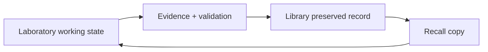

# 📚 DrMarchand’s ⚛︎ Library™

> A preservation, indexing, curation, and recall surface for records that have earned a durable home.

**Public repository:** `DrMarchand/drmarchandslibrary.org` · **Preservation is not publication**

## What the Library does

- preserves eligible records and their provenance;
- indexes material for retrieval and relationship mapping;
- separates historical evidence from current operating truth;
- supports recall without silently overwriting the preserved record;
- keeps private custody detail out of public documentation.

## Laboratory / Library boundary

The Laboratory changes. The Library preserves. A recalled artifact becomes a working instance; it does not mutate the preserved source simply because it was opened again.

## Record discipline

A file appearing here is not automatically verified, immutable, encrypted, authoritative, or permanently archived. Those states require the evidence and custody controls appropriate to the specific artifact.

Historical documents may retain old terminology as provenance. Current documentation should use current identities and clearly label superseded language.

## Public boundary

No credentials, private storage locators, private production markers, identity proofs, or sensitive business records belong in the public Library surface.

## Authority and rights

The Library operates within the Design Orchard / DrMarchand ecosystem. Work-specific rights, licenses, provenance, and publication records remain controlling for individual artifacts.
